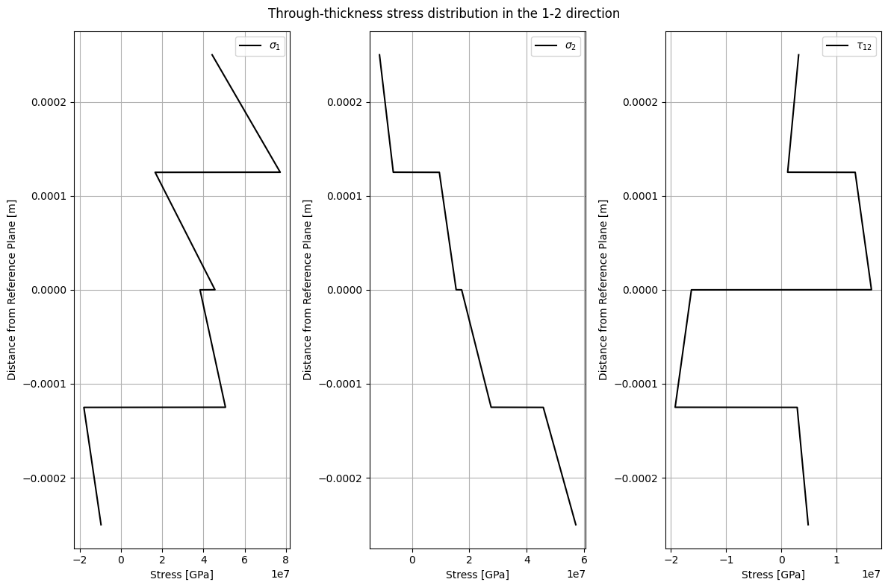

# Composite Laminate Stress and Failure Analysis

This repository contains the implementation and application of the **Classical Laminate Plate Theory (CLPT)** for analyzing laminate stress, strain distributions, failure prediction using various failure theories, and buckling predictions for composite and sandwich laminates. The work is part of **SESG6039 – Composites Engineering Design and Mechanics Individual Assignment 3**.

---

## Objectives

The goal of this assignment is to:
1. Extend the CLPT code developed in Assignment 1 to analyze:
   - Laminate stress and strain distributions.
   - First ply failure predictions using **Maximum Stress**, **Maximum Strain**, and **Tsai-Wu failure theories**.
   - Buckling predictions for composite and sandwich laminates.
2. Visualize through-thickness stress distributions in laminate coordinate systems.

---

## Repository Contents

- **`CW3.ipynb`**: Jupyter Notebook containing detailed calculations, visualizations, and results for the assignment.
- **`CW3.py`**: Python script implementing the CLPT and analysis functions.
- **`Individual Assignment 3.pdf`**: Assignment brief detailing the tasks and requirements.
- **`SESG6039 – Composites CW3 - Abhinandan Thour.docx`**: Report documenting the analysis and findings.
- **`Q3.png`**: Stress distribution visualization in the (x, y) laminate coordinate system.
- **`Q4.png`**: Stress distribution visualization in the (1, 2) material coordinate system.

---

## Visualizations

### Through-Thickness Stress Distributions in the (x, y) Coordinate System


### Through-Thickness Stress Distributions in the (1, 2) Coordinate System


These figures illustrate the variation of stresses across the thickness of the laminate and the discontinuities at ply interfaces.

---

## Code Explanation

### Overview
The CLPT-based code in `CW3.py` is designed to:
1. Compute mid-surface strains and curvatures for specified loading conditions.
2. Calculate through-thickness stress distributions for a given laminate stacking sequence.
3. Predict first ply failure using:
   - Maximum Stress Theory
   - Maximum Strain Theory
   - Tsai-Wu Theory (with interaction parameter \( F_{12}^* = -0.5 \)).
4. Analyze buckling in sandwich plates.

### Code Structure
1. **Input Parameters**:
   - Laminate stacking sequence (e.g., [90, 45, -45, 0]).
   - Material properties (\( E_1, E_2, G_{12}, \nu_{12} \)).
   - Ply thickness and applied loading conditions.

2. **Laminate Analysis**:
   - Computes the mid-surface strains and curvatures using the laminate constitutive relations.
   - Derives stress values in both laminate and material coordinate systems.

3. **Failure Prediction**:
   - Identifies the first ply failure and mode of failure for different criteria.

4. **Buckling Analysis**:
   - Predicts global and local buckling loads for sandwich plates.

---

## How to Run

1. Clone the repository:
   ```bash
   git clone <repository-url>
   cd <repository-folder>

## Citation

This work is part of the **SESG6039 – Composites Engineering Design and Mechanics** coursework.

> **Author**: Abhinandan Thour  
> **Student ID**: 32453515  
> **University**: University of Southampton  
> **Year**: 2024  

For detailed insights, refer to the [assignment report](SESG6039%20%E2%80%93%20Composites%20CW3%20-%20Abhinandan%20Thour.docx).
